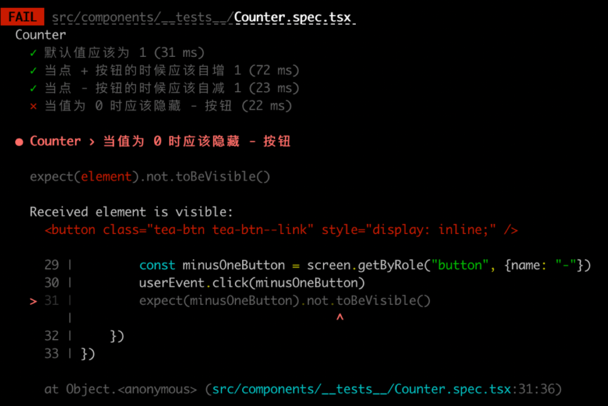

## 为什么需要测试

### 场景
日常：老项目上加上新的功能
你对新功能大致做了一下技术分析，有一个公共组件可能可以重用，但是内部功能耦合地比较厉害，于是就开始一边写，一边阅读和修改老代码。途中发现有一段代码看起来乱七八糟最后也没做什么有用的操作，感觉可能是一段没有用的代码，重要的是还影响到了自己添加新功能，于是这个时候你会怎么办 ？
- 删了/重构这段代码（后续：自己简单看一下其他引用的地方没问题就行了，或者找测试帮忙回归一下这个组件被使用的地方，测试 :eyeroll ）
- 找其他办法添加功能（后续：自己又重写/copy一个类似的公共组件只给现在这个功能用, 其他dev :face_palm）
- 找到这段代码是谁写的，拉过来问问这是在干啥（后续：等等我回忆回忆，我也不记得了，你先自己看看，没什么用就删了吧）
  这个时候，能怎么办？问题到底出在哪了？

### 问题
痛苦的根源是：没有人能确切地告诉你，这段代码是用来干嘛的（负责的业务逻辑），现在能删或者不能删，否则会出什么问题。
场景：如果删除以后，出现这样的文档，事情会不会好办一些？



## 什么是测试
软件中采用 **人工或非人工** 的方式验证软件是否符合工程预期

### 现状
大多数情况下，dev 编写的前端代码都是开发手工自测，提测后由专门的测试人员手工测试。

#### Pros
 - 测试人员能提供 dev 以外的视角，有可能会覆盖到 dev 在写代码时被实现局限以外的情况。

#### Cons
- **遗漏** 不但指测试中对某个功能覆盖的遗漏，包括不可避免地在原有代码或公共代码进行改动时，对原有代码的改动导致其他功能出现问题，且这是对测试人员透明的。
- **耗时** 点开，填数据，操作，验证，刷新，再填数据，再验证。如果再遇到网络或者其他问题，测试的流程会以天为单位。

### 前段自动化测试手段
| 不同的测试 | Details | 一般占比 |
| --- | --- | --- |
| 单元测试（Unit Test）| 对软件组成单元（业务组件/工具函数/公共组件）进行测试，检验软件基本组成单位的正确性 | 多 |
| 集成测试（Integration Test) | 对（已经经过单元测试的）经过二次封装/多个组件及函数组合而成的组件等进行正确性检测 | 中 |
| UI 测试（UI Test）| 对包括功能可用性、功能实现程度（功能流程&amp;业务流程、数据处理&amp;业务数据处理）方面测试 | 少 |

测试人员大多情况下进行的都是功能测试和界面测试。
和 dev 工作最接近的 code 的可读性、可测试性, 才应该是日常开发所需要关注的。

### 测试能为我们带来什么
- **信心** 更放心的写代码，重构，不用担心搞挂别的功能（只要测试全都跑过了）
- **可执行的文档** 好的测试和描述，可以让我们很快知道哪里的功能出了问题
- **更好的代码质量** 能进行单元测试的函数/组件，一定是低耦合的，这也从一定程度上保证了我们的代码质量。好的测试可以让 dev 站在更高的角度审视需求，容易测试的代码通常可读性和维护性都更好

## 怎么样开始写前端测试
我们可以从最简单的单元测试开始，从当前这个组件或功能开始。
### [React 的测试](https://zh-hans.reactjs.org/docs/testing.html)

现在有许多种测试 React 组件的方法。大体上可以被分为两类：
- **渲染组件树** 在一个简化的测试环境中渲染组件树并对它们的输出做断言检查。
- **运行完整应用** 在一个真实的浏览器环境中运行整个应用（也被称为“端到端（end-to-end）”测试）。

### 模拟渲染
Unit Test/ Integration Test
这类测试通常在无法访问真实渲染结果（如浏览器）的环境中运行。对于这些环境，使用 [`jsdom`](https://github.com/jsdom/jsdom) 来模拟浏览器。
jsdom 是一个在 Node.js 内运行的轻量级浏览器实现，可以被当做没有[布局和导航](https://github.com/jsdom/jsdom#unimplemented-parts-of-the-web-platform)功能的常规浏览器，它的运行比为每个测试启动浏览器的方式效率更高。且和编写的测试运行在同一个进程中，所以你能够像在真实的浏览器中一样编写代码来检查和断言渲染的 DOM 及模拟用户交互。
### 端对端 e2e
对于测试更长的工作流程非常有用，特别是当它们对于业务特别重要时。比如测试真实浏览器如何渲染整个应用、从真实的 API 端获取数据、使用 session 和 cookies 以及在不同的链接间导航等功能。你可能还希望不仅在 DOM 状态上进行断言，而同时也在后端数据上进行校验（例如，验证更新是否已经在数据库中持久化）。

## 测试工具
[React 推荐的测试工具](https://zh-hans.reactjs.org/docs/testing.html#tools)

### Jest
>Jest 是一个 JavaScript 测试运行器。它允许你使用 jsdom 操作 DOM 。尽管 jsdom 只是对浏览器工作表现的一个近似模拟，对测试 React 组件来说它通常也已经够用了。Jest 有着十分优秀的迭代速度，同时还提供了若干强大的功能，比如它可以模拟 modules 和 timers 让你更精细的控制代码如何执行。

[Jest Matchers 的简单案例](https://jestjs.io/docs/using-matchers)

```js
test('two plus two is four', () => {
  expect(2 + 2).toBe(4);
});
```
如果需要对渲染的 DOM 进行操作或验证，就需要使用 react-testing-library, Enzyme 或者 React 的 TestUtils
```typescript jsx
// CheckboxWithLabel.js
import React, {useState} from 'react';

const CheckboxWithLabel = ({labelOn, labelOff}) => {
  const [isChecked, setIsChecked] = useState(false);
  const onChange = () => { setIsChecked(!isChecked) };

  return (
    <label>
      <input type="checkbox" checked={isChecked} onChange={onChange} />
      {isChecked ? labelOn : labelOff}
    </label>
  )
};

export default CheckboxWithLabel;
```
```typescript jsx
// __tests__/CheckboxWithLabel-test.js
import React from 'react';
import {cleanup, fireEvent, render} from '@testing-library/react';
import CheckboxWithLabel from '../CheckboxWithLabel';

it('CheckboxWithLabel changes the text after click', () => {
  const {queryByLabelText, getByLabelText} = render(
    <CheckboxWithLabel labelOn="On" labelOff="Off" />,
  );
  expect(queryByLabelText(/off/i)).toBeTruthy();
  fireEvent.click(getByLabelText(/off/i));
  expect(queryByLabelText(/on/i)).toBeTruthy();
});
```

### React testing library
>React testing library 是一组能让你不依赖 React 组件具体实现对他们进行测试的辅助工具。它让重构工作变得轻而易举，还会推动你拥抱有关无障碍的最佳实践。虽然它不能让你省略子元素来浅（shallowly）渲染一个组件，但像 Jest 这样的测试运行器可以通过 mocking 让你做到。

[Testing library 测试 React 的简单案例](https://testing-library.com/docs/react-testing-library/example-intro)
[Common mistakes with React Testing Library](https://kentcdodds.com/blog/common-mistakes-with-react-testing-library/)

```js
const server = setupServer(
  rest.get('/greeting', (req, res, ctx) => {
    return res(ctx.json({greeting: 'hello there'}))
  }),
)

test('loads and displays greeting', async () => {
  render(<Fetch url="/greeting" />)

  fireEvent.click(screen.getByText('Load Greeting'))

  await waitFor(() => screen.getByRole('heading'))

  expect(screen.getByRole('heading')).toHaveTextContent('hello there')
  expect(screen.getByRole('button')).toBeDisabled()
})
```

## 在项目中引入测试

### 引入测试工具
```cmd
npm i -D jest @types/jest @testing-libray/react
```

初始化测试配置
```js
// jest.config.js
module.exports = {
  testEnvironment: "jsdom" // 浏览器环境下运行测试
}
```
### Typescript
如果你的代码库是基于 typescript 的, jest 不能直接运行 ts, 被测/测试文件要被转换为 js 文件才能运行, jest 提供了[通过 babel 去掉 type 注解以支持 ts 的办法](https://jestjs.io/docs/getting-started#using-typescript), 但是为了类型仍然可以在测试中工作、得到检查，我们使用 [ts-jest](https://kulshekhar.github.io/ts-jest/docs/getting-started/installation)
```cmd
npm i -D ts-jest
```

### React testing library

为了更方便，更简单的测试 React Component, 我们同时也会引入 React testing library
```cmd
npm i -D @testing-library/react
```
提供 render, screen 可以让我们简单的渲染组件，并拿到渲染后的 DOM 以用来验证。
React Testing Library 建立在 `DOM Testing Library` 之上，后者提供了一些便捷的 API 以写出 好维护的 DOM 测试。
- getBy
- findBy (async)
- queryBy (not found)
- ...

>您的测试与您的软件使用方式越相似，它们就可以给您越多的信心

```js
test("", () => {
  render(<App />)
  screen.getByAltText("提交") // 获取到 App 下 alt 为提交的按钮
})
```
#### Testing Library 生态
为了写出好维护的测试，可以使用 `@testing-library` 生态下的
1. `jest-dom` [自定义 DOM element matchers](https://github.com/testing-library/jest-dom#custom-matchers)
- `toBeVisible`
- `toBeInTheDocument`
2. `user-event` [模拟更贴近用户真实行为的浏览器事件](https://github.com/testing-library/testing-library-docs/blob/main/docs/ecosystem-user-event.mdx)
- `click` 点击事件会先触发 hover 事件
- `type` 事件会先触发 click 事件, 可以 skipClick

安装
```cmd
npm i -D @testing-library/jest-dom
npm i -D @testing-library/user-event @testing-library/dom
```

jest-dom [扩展断言配置](https://github.com/testing-library/jest-dom#usage)
```
// In your own jestSetup.ts (or any other name)
import '@testing-library/jest-dom'

// In jest.config.js add (if you haven't already)
setupFilesAfterEnv: ['<rootDir>/jestSetup.ts']
```

```
// In tsconfig.json
  "include": [
    ...
    "./jest-setup.ts"
  ],
```

使用
```js
it("当点 + 按钮的时候应该自增 1", () => {
  render(<Counter />)
  // user-event
  userEvent.click(screen.getByRole("button", {name: "+"}))
  // jest-dom
  expect(counterValueElement).toHaveTextContent("2")
})
```

### 其他问题

Jest 只能运行纯 js, 并且只支持 node 支持的语法。所以当我们在项目中使用 jsx, ts 等语法时就需要 [transfrom](https://jestjs.io/docs/next/code-transformation)。我们写的 ts 和 tsx 都通过 `ts-jest` 来 transform 为 js了。

还有一个需要注意的事情，默认情况下 jest 并不会 transform 所有在 node_modules 中的包，因为大多数包都已经转为 node 可以支持的语法了，它们可以被直接执行。 但总有一些特例，比如有些包会直接导出使用 ESM 的

这个时候我们就需要让 jest 的 transform 去处理这些文件。
```js
// jest.config.js
module.exports = {
  //...
  transformIgnorePatterns: ["node_modules/(?!esm-module)"]
};
```

transformIgnorePatterns 的默认值包含了为 `["/node_modules/"]`
上面的语法就是告知 jest, 除了 `node_modules/esm=module` 不要 transform 任何 `node_modules`下的文件。

参考 [jest `transformIgnorePatterns`](https://jestjs.io/docs/configuration#transformignorepatterns-arraystring) 以及 [ts-jest Transform (node)-module explicitly](https://github.com/kulshekhar/ts-jest/blob/main/TROUBLESHOOTING.md#transform-node-module-explicitly)
